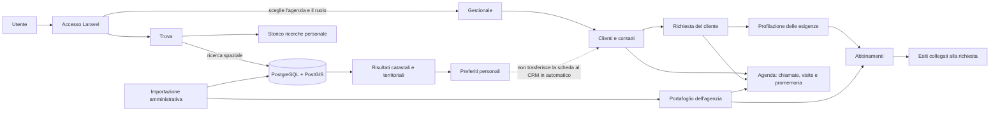

# REKO spiegato in modo semplice

## Da dove arrivano le richieste

Una **richiesta** è ciò che una persona cerca: per esempio un appartamento in acquisto a Milano, con un certo budget e numero di camere. L'agenzia la registra nel Gestionale collegandola a un cliente. Poi completa la profilazione; il sistema può confrontare i criteri con gli immobili presenti nel portafoglio dell'agenzia.

La richiesta non nasce automaticamente da una ricerca Trova. In Trova i risultati salvati e lo storico appartengono al singolo account. Al momento non c'è il comando che trasferisce un risultato salvato in un cliente o in una richiesta CRM.

## Che cosa fa ogni area

- **Trova** interroga il catalogo con PostgreSQL e PostGIS in base ai filtri geografici e immobiliari. Lo storico e i preferiti sono personali.
- **Gestionale** raccoglie clienti, richieste, immobili commerciali, abbinamenti e attività dell'agenzia. In Agenda si possono registrare attività e promemoria singoli, assegnati e collegati a un cliente o a un immobile.
- **Importazioni** caricano dati catastali e territoriali nei cataloghi. L'importazione non crea clienti o richieste commerciali.
- **Amministrazione** gestisce utenti, ruoli e agenzie. Il Responsabile vede i dati dell'agenzia selezionata; Segreteria e Operatore vedono le sezioni e i record consentiti dal proprio ruolo e assegnamento.

## Percorso tipico

1. L'agente registra il cliente.
2. Inserisce la richiesta concordata con il cliente e compila le sue esigenze.
3. Il Gestionale confronta la richiesta con il portafoglio dell'agenzia e mostra gli abbinamenti disponibili.
4. L'agente registra chiamate, visite o promemoria in Agenda e collega le attività al cliente, alla richiesta o all'immobile.
5. In Trova può fare ricerche catastali e salvare risultati per il proprio account; per passare quei dati al CRM serve ancora un collegamento esplicito.
